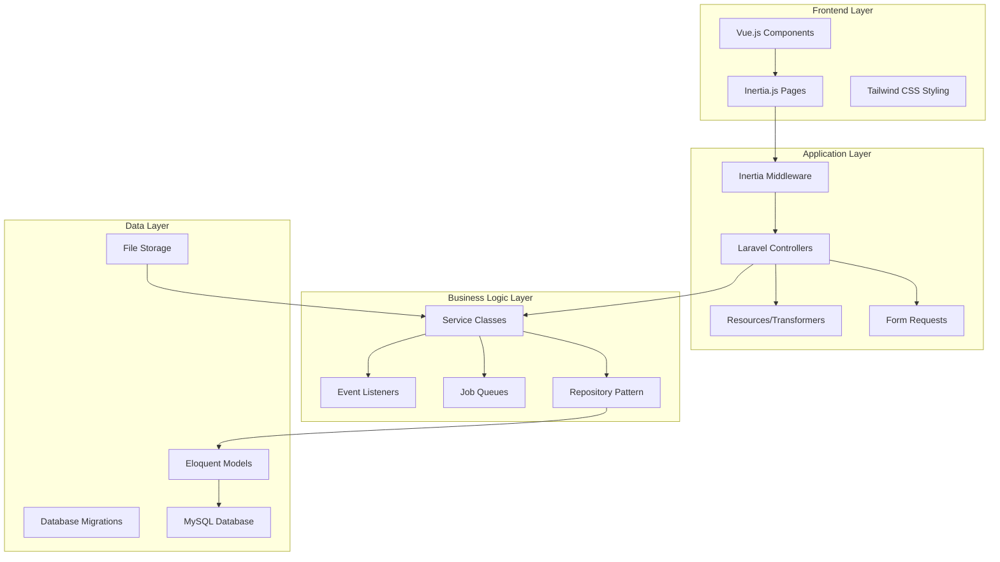
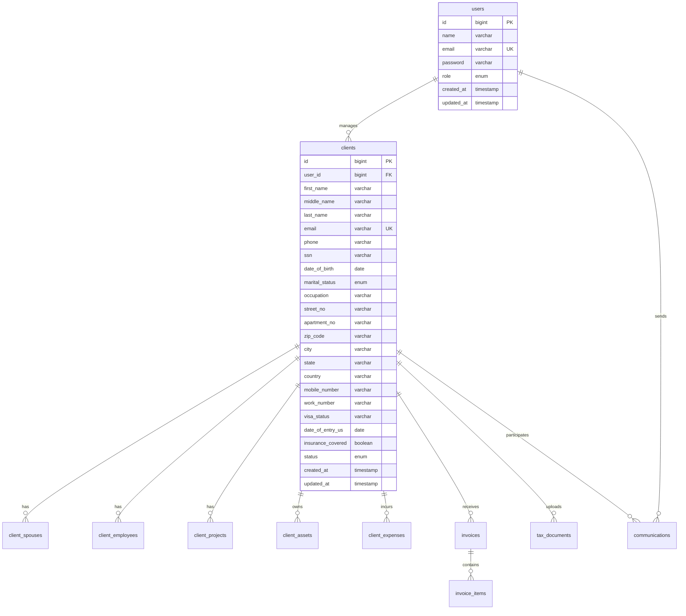
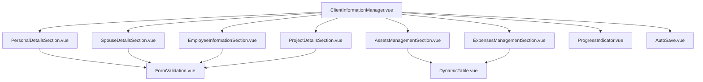

# My Super Tax Design Document

## Overview

The My Super Tax is a comprehensive web application built using the Laravel-Inertia-Vue stack, designed to facilitate efficient tax consulting operations through two primary interfaces: an Admin Dashboard for tax professionals and a Client Panel for end users. The platform emphasizes the Client Information Manager as a core feature, providing comprehensive client data management capabilities accessible from both admin and client interfaces.

The system architecture follows modern SPA principles with server-side rendering capabilities, ensuring optimal performance and user experience while maintaining data security and compliance with tax industry standards.

## Architecture

### Technology Stack

- **Backend**: Laravel 10+ framework with PHP 8.1+
- **Frontend**: Vue.js 3 with Composition API
- **SPA Middleware**: Inertia.js for seamless page transitions
- **Database**: MySQL 8.0+ with InnoDB storage engine
- **Authentication**: Laravel Sanctum for API authentication
- **File Storage**: Laravel Storage with S3 compatibility
- **Styling**: Tailwind CSS with custom component library

### System Architecture



### Database Architecture

The database follows a normalized structure with proper relationships and indexing for optimal performance:



## Components and Interfaces

### Client Information Manager Component Architecture

The Client Information Manager is designed as a modular component system that can be used in both admin and client contexts:

#### Core Components

1. **ClientInformationManager.vue** - Main container component
2. **PersonalDetailsSection.vue** - Personal information form section
3. **SpouseDetailsSection.vue** - Spouse information with conditional display
4. **EmployeeInformationSection.vue** - Employment details management
5. **ProjectDetailsSection.vue** - Project tracking interface
6. **AssetsManagementSection.vue** - Dynamic assets table
7. **ExpensesManagementSection.vue** - Dynamic expenses table
8. **DynamicTable.vue** - Reusable table component for assets/expenses
9. **FormValidation.vue** - Real-time validation component
10. **ProgressIndicator.vue** - Section completion tracking

#### Component Hierarchy



### Admin Dashboard Interface Design

#### Layout Structure

- **Sidebar Navigation**: Fixed left sidebar with collapsible functionality
- **Main Content Area**: Dynamic content area with breadcrumb navigation
- **Header Bar**: User information, notifications, and quick actions
- **Footer**: System information and support links

#### Client List Interface

- **Data Table**: Responsive table with virtual scrolling for large datasets
- **Advanced Filters**: Multi-criteria filtering with saved filter presets
- **Bulk Actions**: Checkbox selection with bulk operation toolbar
- **Action Buttons**: Color-coded buttons with consistent iconography

### Client Panel Interface Design

#### Responsive Layout

- **Mobile-First Design**: Optimized for tablet and desktop usage
- **Progressive Enhancement**: Enhanced features for larger screens
- **Touch-Friendly**: Appropriate touch targets and gestures
- **Accessibility**: WCAG 2.1 AA compliance

## Data Models

### Client Information Model Structure

```typescript
interface ClientInformation {
  // Personal Details
  id: number;
  firstName: string;
  middleName?: string;
  lastName: string;
  email: string;
  phone: string;
  ssn: string;
  dateOfBirth: Date;
  maritalStatus: 'single' | 'married' | 'divorced' | 'widowed';
  occupation: string;
  insuranceCovered: boolean;
  
  // Address Information
  streetNo: string;
  apartmentNo?: string;
  zipCode: string;
  city: string;
  state: string;
  country: string;
  
  // Contact Information
  mobileNumber: string;
  workNumber?: string;
  
  // Immigration Information
  visaStatus?: string;
  dateOfEntryUS?: Date;
  
  // Related Information
  spouse?: SpouseInformation;
  employees: EmployeeInformation[];
  projects: ProjectInformation[];
  assets: AssetInformation[];
  expenses: ExpenseInformation[];
  
  // Metadata
  status: 'active' | 'inactive' | 'archived';
  completionStatus: CompletionStatus;
  createdAt: Date;
  updatedAt: Date;
}

interface SpouseInformation {
  firstName: string;
  lastName: string;
  ssn?: string;
  dateOfBirth?: Date;
  occupation?: string;
}

interface AssetInformation {
  id: number;
  assetName: string;
  dateOfPurchase: Date;
  percentageUsedInBusiness: number;
  costOfAcquisition: number;
  anyReimbursement?: number;
}

interface ExpenseInformation {
  id: number;
  category: 'miscellaneous' | 'residency';
  particulars: string;
  taxPayer: string;
  spouse?: string;
  amount: number;
  remarks?: string;
}
```

### Data Validation Rules

```typescript
const validationRules = {
  personalDetails: {
    firstName: 'required|string|max:50',
    lastName: 'required|string|max:50',
    email: 'required|email|unique:clients,email',
    ssn: 'required|regex:/^\d{3}-\d{2}-\d{4}$/',
    dateOfBirth: 'required|date|before:today',
    phone: 'required|regex:/^\+?[\d\s\-\(\)]+$/',
  },
  assets: {
    assetName: 'required|string|max:100',
    dateOfPurchase: 'required|date',
    percentageUsedInBusiness: 'required|numeric|min:0|max:100',
    costOfAcquisition: 'required|numeric|min:0',
  },
  expenses: {
    particulars: 'required|string|max:200',
    taxPayer: 'required|string|max:100',
    amount: 'required|numeric|min:0',
  }
};
```

## Error Handling

### Client-Side Error Handling

1. **Form Validation Errors**: Real-time field validation with inline error messages
2. **Network Errors**: Graceful handling of connectivity issues with retry mechanisms
3. **Session Expiration**: Automatic session renewal with data preservation
4. **File Upload Errors**: Progress indication and error recovery for document uploads

### Server-Side Error Handling

1. **Validation Errors**: Structured error responses with field-specific messages
2. **Database Errors**: Transaction rollback and error logging
3. **File Storage Errors**: Fallback storage options and error notifications
4. **Authentication Errors**: Secure error messages without information disclosure

### Error Response Structure

```typescript
interface ErrorResponse {
  message: string;
  errors?: {
    [field: string]: string[];
  };
  code: string;
  timestamp: Date;
  requestId: string;
}
```

## Testing Strategy

### Unit Testing

- **Model Testing**: Eloquent model relationships and business logic
- **Service Testing**: Business logic and data transformation services
- **Component Testing**: Vue.js component functionality and props
- **Validation Testing**: Form validation rules and error handling

### Integration Testing

- **API Testing**: Controller endpoints and middleware functionality
- **Database Testing**: Migration and seeding processes
- **File Upload Testing**: Document storage and retrieval processes
- **Authentication Testing**: User authentication and authorization flows

### End-to-End Testing

- **User Workflows**: Complete user journeys from login to task completion
- **Cross-Browser Testing**: Compatibility across modern browsers
- **Responsive Testing**: Functionality across different screen sizes
- **Performance Testing**: Load testing and optimization validation

### Testing Tools and Framework

```typescript
// Jest configuration for Vue components
export default {
  testEnvironment: 'jsdom',
  setupFilesAfterEnv: ['<rootDir>/tests/setup.js'],
  moduleNameMapping: {
    '^@/(.*)$': '<rootDir>/resources/js/$1',
  },
  transform: {
    '^.+\\.vue$': '@vue/vue3-jest',
    '^.+\\.js$': 'babel-jest',
  },
};

// PHPUnit configuration for Laravel
class ClientInformationTest extends TestCase {
    use RefreshDatabase;
    
    public function test_client_information_creation(): void {
        $clientData = [
            'first_name' => 'John',
            'last_name' => 'Doe',
            'email' => 'john@example.com',
            'ssn' => '123-45-6789',
        ];
        
        $response = $this->post('/clients', $clientData);
        $response->assertStatus(201);
        $this->assertDatabaseHas('clients', $clientData);
    }
}
```

## Security Considerations

### Data Protection

1. **Encryption**: All sensitive data encrypted at rest and in transit
2. **Access Controls**: Role-based permissions with principle of least privilege
3. **Audit Logging**: Comprehensive logging of all data access and modifications
4. **Data Retention**: Automated data archival and deletion policies

### Authentication and Authorization

1. **Multi-Factor Authentication**: Optional 2FA for enhanced security
2. **Session Management**: Secure session handling with automatic timeout
3. **Password Policies**: Strong password requirements and regular rotation
4. **API Security**: Rate limiting and request validation

### Compliance

1. **Tax Industry Standards**: Compliance with IRS data protection requirements
2. **GDPR Compliance**: Data subject rights and privacy controls
3. **SOC 2 Type II**: Security and availability controls
4. **Regular Security Audits**: Quarterly security assessments and penetration testing

## Performance Optimization

### Frontend Optimization

1. **Code Splitting**: Lazy loading of components and routes
2. **Asset Optimization**: Image compression and CDN delivery
3. **Caching Strategy**: Browser caching and service worker implementation
4. **Bundle Analysis**: Regular analysis and optimization of JavaScript bundles

### Backend Optimization

1. **Database Indexing**: Optimized indexes for frequent queries
2. **Query Optimization**: Eager loading and query result caching
3. **API Response Caching**: Redis-based caching for frequently accessed data
4. **Background Processing**: Queue-based processing for heavy operations

### Monitoring and Analytics

1. **Performance Monitoring**: Real-time application performance monitoring
2. **Error Tracking**: Comprehensive error logging and alerting
3. **User Analytics**: Usage patterns and feature adoption tracking
4. **Infrastructure Monitoring**: Server performance and resource utilization

This design document provides a comprehensive foundation for implementing the Client Information Manager functionality within the My Super Tax, ensuring scalability, maintainability, and optimal user experience across both admin and client interfaces.